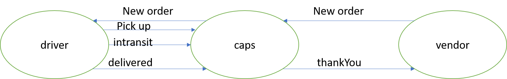

# caps

## Links and Resources

- [ci/cd](https://github.com/areenjaradat/caps/actions) (GitHub Actions)

- [Repo link](https://github.com/areenjaradat/caps)

- [PR link](https://github.com/areenjaradat/caps/pulls)

### Setup

#### `.env` requirements

#### How to initialize/run your application (where applicable)

- `node caps.js`

#### Tests

- How do you run tests?
   `npm test`

#### UML

